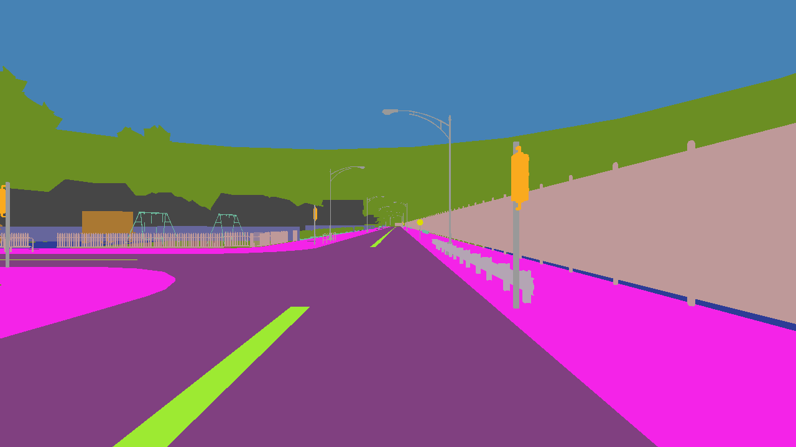

# Semantic Segmentation with CARLA 0.9.15 dataset

## Description

This project leverages the CARLA simulator to create a dataset for semantic segmentation of urban driving scenes. Semantic segmentation is a crucial task in autonomous driving, where the goal is to classify each pixel in an image into predefined categories such as roads, sidewalks, vehicles, pedestrians, etc. Using the high-fidelity simulation environment of CARLA, we can generate realistic annotated data to train and evaluate segmentation models.

### Prerequisites

Ensure you have the following installed:
- [CARLA](https://carla.org/)
- [Anaconda](https://www.anaconda.com/)
- numpy
- opencv-python
- matplotlib
- tensorflow
- Scikit-learn

